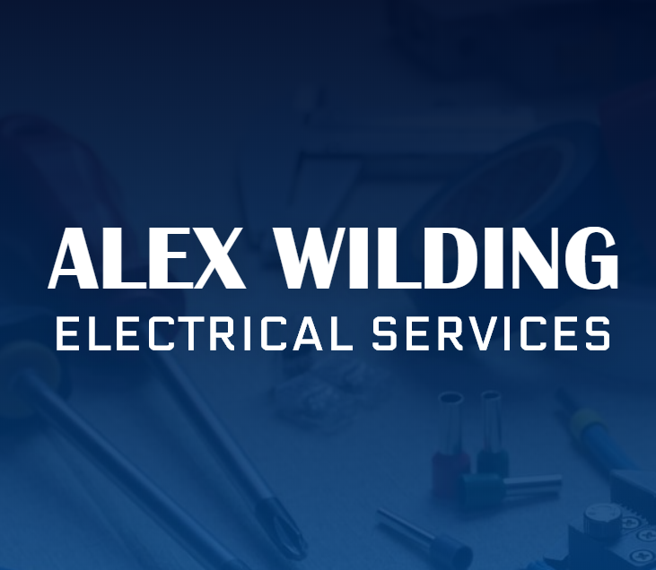
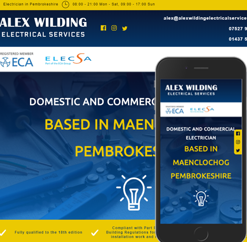

<!-- AUTO-GENERATED-CONTENT:START (STARTER) -->
<p align="center">
  <a href="https://www.alexwildingelectricalservices.com/">
    
  </a>
</p>
<h1 align="center">
  Alex Wilding Electrical: Small Business Website 
</h1>

<p align="center">A small business website made with Gatsby.</p>

<div align="center">

  </div>

<!-- FRAMEWORKS -->
## Built With

* [Gatbsy](https://www.gatsbyjs.org/)
* [React](https://reactjs.org/)

## Features

* Social Media Icon Bar 
* Custom GraphQL Image Component (lazy load, size and quality control)   
* SEO Plugin & Keyword Optimisation
* Self Hosted Fonts
* Fully responsive UI
* Bespoke SVG Navigation Component 
* Prettier Code Styling


<!-- GETTING STARTED -->
## Getting Started

Clone the repo
```
git clone https://github.com/izabellewilding/website-for-electrician.git
cd website-for-electrician
```

Install dependencies
```
npm install
```

Run Gatsby in development mode
```
gatsby develop
```

* visit http://localhost:8000


<!-- CONTACT -->
## Contact

Izabelle Wilding - izabellewilding@gmail.com

Project Link: [https://github.com/izabellewilding/gatsby-recipe-blog.git](https://github.com/izabellewilding/website-for-electrician)


<!-- AUTO-GENERATED-CONTENT:END -->
